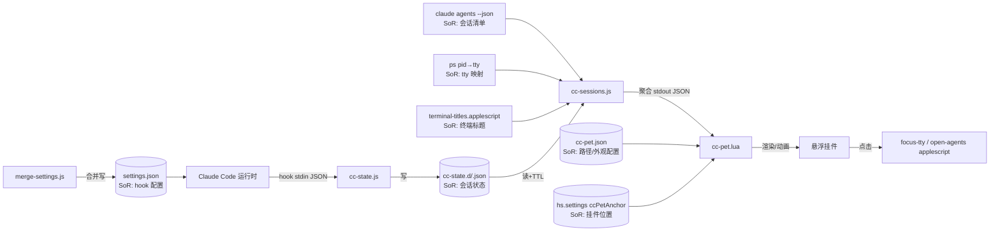

# Claude Code 悬浮 Pet —— 需求分析报告

- 分析对象:`/Users/jessie/claude-code-pet`(commit `6f6bd89`,3 个提交,2026-07-02 ~ 07-03)
- 分析日期:2026-07-03
- 分析方法:源码考古(逐文件通读)+ 文档对照(README 中/英)+ Git 历史分析 + 静态度量(wc/grep)
- 分析角色:业务分析师(Business Analyst)
- 一句话结论:**这是一个可用的 v0.1 早期原型**,核心链路(hook 写状态 → 聚合 → 挂件渲染 → 点击跳转)已打通;但存在**被低估的安全隐患(全局自动放行 Read/Glob/Grep)**、**平台/终端覆盖窄**、**无测试/无版本/无错误可见性**三类主要缺口。下一步优化按 MoSCoW 排入 v0.2 / v0.3。

---

## 0. 一手事实速览(度量基线)

| 指标 | 实测值 | 来源 |
|---|---|---|
| 源码总行数 | 739 行(不含 README/LICENSE) | `wc -l` |
| 主挂件 `cc-pet.lua` | 263 行 | 同上 |
| Hook 脚本 | `cc-sessions.js` 95 / `cc-state.js` 48 / `cc-autoallow.js` 26 行 | 同上 |
| AppleScript | 3 个(titles 39 / open-agents 58 / focus-tty 43) | 同上 |
| 安装/卸载/合并 | `install.sh` 65 / `uninstall.sh` 31 / `merge-settings.js` 71 | 同上 |
| 状态数 | 5 态 + 1 终止态(`__end__`) | `cc-state.js` MAP |
| 注册 hook 事件 | 7 个状态事件 + 1 个 PreToolUse 放行 = 8 条写入 settings.json | `merge-settings.js` |
| 数据轮询频率 | 每 2s(`doEvery(2, poll)`) | `cc-pet.lua:252` |
| 动画帧率 | 0.07s/帧 ≈ 14.3fps(常驻运行) | `cc-pet.lua:254` |
| 面板最大会话数 | `MAX_CHIPS = 8` | `cc-pet.lua:41` |
| 支持平台 | 1(仅 macOS) | `install.sh:15` |
| 支持终端 | 2(iTerm2、Terminal.app) | applescript × 全部 |
| 自动放行工具 | 3(Read/Glob/Grep) | `cc-autoallow.js:7` |
| 自动化测试 / CI / CONTRIBUTING | 0 / 0 / 0 | `find`、无 `.github` |
| Git 提交数 | 3(功能 1 + 文档 2) | `git log` |

**状态 TTL 生命周期(cc-sessions.js)**:working(45s)→ done(6s)→ waiting(5min)→ idle;needs 独立 120s 后降级为 idle;idle 超过 15min(STALE)不再显示。

---

## 1. 干系人分析 + RACI 矩阵

开源工具场景,干系人按"影响力 × 关注点 × 成功定义"识别:

| 干系人 | 影响力 | 核心关注点 | 成功定义 |
|---|---|---|---|
| 维护者 / 作者(jessie) | 高 | 维护成本、口碑、安全责任 | 低维护开销下获得 star/采用,无安全事故 |
| 终端用户(跑多个 Claude Code 会话的开发者) | 高 | 装得上、看得准、不打扰、不泄密 | 一眼看清哪个会话要我处理,点一下即达 |
| 贡献者(PR/Issue) | 中 | 代码可读、可测、可扩展 | 能快速加终端/加平台并合入 |
| Claude Code 官方(上游) | 中(被依赖) | hook/CLI 接口稳定性 | 三方集成不误用权限模型 |
| Hammerspoon 生态 | 低 | Lua API 用法合规 | 无 |
| 安全审查者 / 谨慎用户 | 中 | 自动放行边界、配置改写 | 明确知道改了什么、能一键还原 |

### RACI(关键决策)

| 决策事项 | 维护者 | 用户 | 贡献者 | 上游 CC |
|---|---|---|---|---|
| 自动放行工具白名单范围 | **A/R** | C | C | I |
| 改写 `~/.claude/settings.json` 的方式 | **A/R** | C | I | I |
| 支持哪些终端 / 平台 | **A** | C | **R** | I |
| 状态机 / TTL 参数口径 | **A/R** | C | C | I |
| 版本发布与兼容策略 | **A/R** | I | C | I |
| 依赖 `claude agents --json` 契约 | A | I | C | **R** |

(R=执行,A=批准,C=咨询,I=知会)

---

## 2. 需求获取(方法与三角验证)

- **源码考古**:逐行读取 lua/js/applescript/sh 全部 9 个源文件,还原真实职责与数据路径。
- **文档对照**:将 README(中/英)承诺功能逐条与代码实现比对,记录差距(见 §4)。
- **Git 历史分析**:3 个提交,首个提交即含全部功能(857 insertions),后两个仅文档 —— 说明功能面自初版后**未迭代**,处于原型冻结态。
- **静态度量**:`wc -l` / `grep` 量化行数、轮询频率、TTL、白名单。
- **三角验证**:对"5 态"这一关键概念做三方交叉——README 描述、`cc-pet.lua` 的 `EMOJI` 表、`cc-state.js` 的 `MAP` 三处一致(working/needs/waiting/done/idle),口径**统一**,可信。对"自动放行范围"做三方交叉——README 安全说明、`cc-autoallow.js` 的 `ALLOW` 集、`merge-settings.js` 写入的 `matcher`,三处均为 `Read/Glob/Grep`,**双重闸门**(matcher + JS 校验),实现一致。

---

## 3. 现状(As-Is)业务流程

### 3.1 状态采集与展示(Happy Path)

```
Claude Code 触发事件(7 类)
   └─PreToolUse/PostToolUse/UserPromptSubmit/Notification/Stop/SessionStart/SessionEnd
        │ hook(stdin 传 JSON)
        ▼
   cc-state.js <Event>
        │ 按 MAP 映射为 state;Notification 再按 message 英文关键词分 needs/waiting
        ▼
   写 ~/.claude/hooks/cc-state.d/<sid>.json  = {state, ts, sid}
        │
   Hammerspoon 每 2s 异步 runTask(node cc-sessions.js)
        ▼
   cc-sessions.js 聚合:
        ├─ claude agents --json      →  哪些会话(sid/pid/status/name/startedAt)
        ├─ ps -o pid=,tty=           →  pid→tty(过滤 tty=="??" 的死会话)
        ├─ terminal-titles.applescript → tty→标题(iTerm2 + Terminal.app)
        └─ 读 <sid>.json + TTL 降级  →  最终 state
        ▼
   输出 [{sid,name,tty,state,ts}](按状态优先级+启动时间排序)
        │ 仅当签名(sig)变化时才 render() 重建面板
        ▼
   cc-pet.lua 渲染面板 + 独立 14fps animate() 逐帧动画
```

### 3.2 点击跳转(Happy Path)

```
点击会话行 → onClick(id) → 有真实 tty?
   ├─ 是 → focus-tty.applescript /dev/ttys### → iTerm2/Terminal 聚焦该会话 → "ok"
   │         └─失败(none)→ 回退 openAgentsAsync()
   └─ 否 → open-agents.applescript → 聚焦或新开 `claude agents` 窗口
```

### 3.3 异常路径(代码中已存在的)

- `claude agents --json` 失败 / 非 0 退出 → `poll` 静默 return,面板保持上次状态(用户无感知失败)。
- JSON 解析失败 → `pcall`/`try` 静默吞掉。
- tty 为空/`??` → 会话被过滤,不显示。
- 拖动无辅助功能权限 → 弹一次系统授权请求,点击仍可用(走 `mouseUp` 分支)。
- SessionEnd → 删除 `<sid>.json`。

### 3.4 安装/卸载流程

- `install.sh`:检查依赖(node 必需,Hammerspoon/claude/iTerm 缺失仅告警)→ 复制 hooks 与 lua → 向 `init.lua` 幂等追加 `require("cc-pet")` → **备份**后调 `merge-settings.js` 合并 → `hs.reload()`。
- `merge-settings.js`:读取现有 settings.json,**合并不覆盖**,以脚本文件名判定"是本工具条目"实现幂等与精准卸载。

---

## 4. 差距分析(As-Is vs 期望,量化影响)

| # | 差距 | 现状证据 | 量化影响 | 严重度 |
|---|---|---|---|---|
| G1 | **全局自动放行 Read/Glob/Grep,含敏感文件** | `cc-autoallow.js` 写入用户级 settings.json,对所有项目生效 | Read 可无确认读取 `~/.ssh`、`.env`、凭证等**任意文件**并进入上下文;影响面=该机器全部 Claude 会话 | 高 |
| G2 | **失败对用户不可见** | `poll`/解析全 `pcall`/try 静默吞 | 用户无法区分"全空闲"与"脚本挂了";排障成本高 | 高 |
| G3 | **平台/终端覆盖窄** | 仅 macOS;仅 iTerm2+Terminal.app | Warp/WezTerm/kitty/Alacritty/VS Code 终端/tmux 用户=0 支持;潜在用户流失 | 中 |
| G4 | **依赖不稳定契约** | `claude agents --json` 无版本守卫 | 上游一改格式即整体失效,无降级、无提示 | 中 |
| G5 | **Notification 分类仅英文关键词** | `cc-state.js:34` 正则 `permission|approve|...` | 非英文/措辞变化的通知会把 needs 误判为 waiting,漏掉"红色告警" | 中 |
| G6 | **无测试/CI/版本标签** | `find` 无 test,无 `.github`,无 git tag | 回归风险高;贡献者无基线;用户无法锁版本 | 中 |
| G7 | **动画常驻 14fps,即使全 idle** | `doEvery(0.07)` 无暂停条件 | 空闲时仍每秒 ~14 次 canvas 变换,笔记本轻微耗电 | 低 |
| G8 | **每 2s 全量 osascript 遍历所有终端窗口** | `terminal-titles.applescript` 无过滤 | 窗口多时每 2s 一次全量 AppleScript,可能卡顿 | 低 |
| G9 | **备份文件无限累积** | `install.sh:45` 每次装都 `.bak.<ts>` | 反复安装堆积备份(已 gitignore,但占磁盘) | 低 |
| G10 | **超 8 会话被截断且无提示** | `MAX_CHIPS=8`,`math.min` | 第 9+ 会话不可见,用户不知被隐藏 | 低 |
| G11 | **多显示器/anchor 越界** | 仅 `primaryScreen`,anchor 持久化 | 换屏后挂件可能定位到屏外 | 低 |
| G12 | **README 表述略强于实现** | "省电"宣称 vs G7;跳转"自动切到 tab"未含失败可见反馈 | 期望管理偏差 | 低 |

---

## 5. 未来态(To-Be)与量化收益

| 改进项 | 对应差距 | To-Be 设计 | 预期量化收益 |
|---|---|---|---|
| T1 安全默认收敛 + 可配白名单 | G1 | 默认放行仅 Glob/Grep(枚举类),Read 改为默认**不**自动放行或提供"排除敏感路径"开关;安装时显式确认 | 消除"无确认读敏感文件"路径;安全事故风险显著下降 |
| T2 健康自检与错误可见 | G2,G4 | 聚合失败时在挂件显示 ⚠ 图标 + tooltip;`claude agents --json` 探测失败给一次性提示 | 排障时间从"不可知"→ 秒级定位 |
| T3 终端适配层抽象 | G3 | 抽出 terminal adapter 接口,新增 Warp/WezTerm/VS Code | 目标终端从 2 → 5+,潜在用户覆盖翻倍 |
| T4 契约版本守卫 | G4 | 校验 `agents --json` 字段;缺字段降级并提示"需升级 CC" | 上游变更时不再静默全挂 |
| T5 通知分类增强 | G5 | 关键词多语言 + 结合 hook 结构化字段而非纯 message | needs 漏报率下降 |
| T6 测试 + CI + 语义化版本 | G6 | 为 js 加单测,GitHub Actions lint,打 `v0.x` tag | 回归可拦截;用户可锁版本 |
| T7 动画自适应节流 | G7,G8 | 无 working/needs/waiting/done 动态态时降到 1fps 或暂停;osascript 结果缓存 | 空闲 CPU/耗电下降(idle 帧从 14→1fps) |
| T8 溢出与多屏处理 | G10,G11 | 超 8 显示"+N";anchor 越界时回弹到可见区 | 信息不丢失,多屏不丢挂件 |
| T9 文档与实现对齐 | G12 | README 增加"安全权衡"专章、跳转失败反馈说明 | 期望管理准确 |

---

## 6. 需求规格(FR / NFR / CON)

编号规则:`FR-nn`(功能)、`NFR-nn`(非功能)、`CON-nn`(约束)。MoSCoW:M=Must / S=Should / C=Could。均附可测试验收要点。

### 6.1 功能需求 FR

| ID | MoSCoW | 需求 | 验收要点 |
|---|---|---|---|
| FR-01 | M | 展示所有"有真实 tty"的 Claude 会话及其状态 | 开 3 个跑 claude 的终端,面板出现 3 行,关 1 个后该行消失 |
| FR-02 | M | 5 态区分并各有动画(working/needs/waiting/done/idle) | 逐态触发,emoji 与动画与 README 一致 |
| FR-03 | M | 点击会话行聚焦其终端;无 tty 时打开 `claude agents` | 点击后目标 tab 前置;伪造无 tty 时打开 agents 窗口 |
| FR-04 | M | 面板可拖动且位置持久化 | 拖动后重载 Hammerspoon 位置保持 |
| FR-05 | M | 状态 TTL 自动降级,避免卡死 | working 超 45s 无刷新降 idle;各 TTL 边界可验 |
| FR-06 | **M(改)** | 只读工具自动放行**且默认边界安全**(见 T1) | 默认配置下读取 `~/.ssh/id_rsa` 仍需确认或被排除;可一键关闭 |
| FR-07 | S | 聚合/依赖失败时挂件可见告警(⚠) | 断开 claude CLI,挂件显示告警而非静默 |
| FR-08 | S | 超 `MAX_CHIPS` 时显示 "+N" 溢出提示 | 开 10 个会话,面板显示 8 行 + "+2" |
| FR-09 | S | 支持在 `cc-pet.json` 配置轮询间隔/外观/白名单 | 改配置后无需改 lua 生效 |
| FR-10 | C | 新增终端适配(Warp / WezTerm / VS Code 终端) | 目标终端下取标题与跳转可用 |
| FR-11 | C | 多语言通知分类 | 中文权限通知能判为 needs |

### 6.2 非功能需求 NFR

| ID | MoSCoW | 需求 | 验收要点 |
|---|---|---|---|
| NFR-01 | M | 主线程不阻塞(全异步 task) | 轮询/跳转期间挂件动画不卡顿(已满足) |
| NFR-02 | M | 幂等安装/精准卸载,不破坏用户 settings.json | 连续装 2 次无重复条目;卸载后 diff 仅移除本工具条目 |
| NFR-03 | S | 空闲态低能耗(动画自适应节流) | idle-only 场景帧率≤1fps,可用 Activity Monitor 验证 |
| NFR-04 | S | 有自动化测试与 CI 基线 | PR 触发 CI,js 单测通过 |
| NFR-05 | S | 失败可观测(日志/挂件提示) | 关键失败写入可查日志 |
| NFR-06 | C | 兼容多显示器 | 换主屏后挂件仍在可见区 |

### 6.3 约束 CON

| ID | 类型 | 约束 | 说明 |
|---|---|---|---|
| CON-01 | 平台 | 仅 macOS | 依赖 AppleScript/Hammerspoon,短期不跨平台 |
| CON-02 | 依赖 | 需 Hammerspoon + Node.js + Claude Code CLI(支持 `agents --json`) | 缺任一功能受限 |
| CON-03 | 权限 | 拖动需"辅助功能";跳转需自动化控制终端权限 | 首次需用户授权 |
| CON-04 | 上游 | 受 `claude agents --json` 与 hook 事件模型约束 | 契约变更风险(见 FR/T4) |
| CON-05 | 预算 | 无资金,成本=维护者时间 | 见 §8 财务维度 |
| CON-06 | 许可 | MIT | 允许自由分发/修改 |

---

## 7. 数据流图与 System of Record(SoR)



各数据实体的权威来源(SoR):

| 数据实体 | System of Record | 权威流向 |
|---|---|---|
| 每会话状态 | `~/.claude/hooks/cc-state.d/<sid>.json` | cc-state.js 唯一写入者 → cc-sessions 只读 |
| 会话清单(sid/pid/status) | `claude agents --json`(上游 CLI) | 只读消费 |
| pid→tty | `ps` | 只读消费 |
| 终端标题 | iTerm2 / Terminal.app(AppleScript) | 只读消费 |
| hook 注册配置 | `~/.claude/settings.json` | merge-settings.js 合并写 → CC 读 |
| 路径/外观配置 | `~/.hammerspoon/cc-pet.json` | 用户写 → lua 读 |
| 挂件位置 | `hs.settings` 键 `ccPetAnchor` | lua 读写 |

**集成契约需固化**:`claude agents --json` 的字段(sessionId/pid/status/name/startedAt)、hook stdin 的 `session_id`/`message`/`tool_name` —— 目前均为隐式约定,建议在 T4 中写成显式校验。

---

## 8. 三维可行性分析(含假设与敏感性)

### 技术可行性:高
- 现有 739 行已跑通全链路,异步架构合理(runTask 保引用防 GC、render/animate 分离)。
- 假设:Hammerspoon canvas/eventtap API 稳定、`agents --json` 存在。
- 敏感性:若上游移除/改名 `agents --json`,核心失效——**结论对该依赖高度敏感**(→ T4 优先级上调)。

### 运营可行性:中
- 采用门槛偏高:需装 Hammerspoon + 授予两类系统权限 + 有 CC CLI。
- 谨慎用户会因"全局自动放行 Read"却步(信任成本)。
- 假设:目标用户为重度多会话开发者,愿装 Hammerspoon。
- 敏感性:安全叙事(T1/T9)直接影响采用意愿与口碑。

### 财务可行性(折算为维护者时间):可行
- 无现金成本;成本=维护者工时。
- 估算:v0.2(安全收敛 T1 + 可见性 T2 + 测试基线 T6)约需集中投入若干个工作块;单点投入即可显著降低"安全事故 + 排障"两类长期时间黑洞。
- 敏感性:若跳过 T6(测试/CI),后续每次改动的回归排查时间会持续侵蚀维护者精力——**不投测试的隐性成本随迭代次数线性增长**。

---

## 9. 需求可追溯矩阵(RTM)

业务目标:**O1** 一眼掌握多会话状态 / **O2** 一键直达需处理的会话 / **O3** 少打扰但不牺牲安全 / **O4** 装得上、还得原、可维护。

| 需求 | 业务目标 | 验收标准(见 §6) | 实现工件(现状) |
|---|---|---|---|
| FR-01 | O1 | 3 会话显示/关闭消失 | cc-sessions.js, cc-pet.lua render |
| FR-02 | O1 | 5 态动画一致 | cc-pet.lua EMOJI/animate, cc-state.js MAP |
| FR-03 | O2 | 点击聚焦/回退开 agents | onClick, focus-tty/open-agents.applescript |
| FR-04 | O1 | 拖动持久化 | mouseHandler/savePos, ccPetAnchor |
| FR-05 | O1 | TTL 边界降级 | cc-sessions.js stateOf/TTL |
| FR-06 | O3 | 敏感文件仍需确认/可关 | cc-autoallow.js(**待改**),merge-settings matcher |
| FR-07 | O1/O4 | 失败显示 ⚠ | **待建**(T2) |
| FR-08 | O1 | "+N" 溢出 | **待建**(T8) |
| FR-09 | O4 | 配置生效免改码 | cc-pet.json(**待扩**) |
| FR-10 | O2 | 新终端可用 | **待建**(T3) |
| FR-11 | O3 | 中文通知判 needs | **待建**(T5) |
| NFR-01 | O1 | 不阻塞 | runTask 异步(已满足) |
| NFR-02 | O4 | 幂等/精准卸载 | merge-settings.js, install/uninstall.sh |
| NFR-03 | O4 | 空闲低能耗 | **待建**(T7) |
| NFR-04 | O4 | CI/测试 | **待建**(T6) |
| NFR-05 | O4 | 可观测 | **待建**(T2) |
| NFR-06 | O1 | 多屏 | **待建**(T8) |

**孤儿校验**:每条 FR/NFR 均可追溯到 ≥1 业务目标;每个目标(O1–O4)均有 ≥1 需求覆盖。无孤儿需求、无未覆盖目标。约束 CON-01~06 作为边界条件,不要求正向实现。

---

## 10. 评审要点与需求冲突决策

### 已识别冲突与建议决策

| 冲突 | 双方诉求 | 建议决策与理由 |
|---|---|---|
| C1 少打扰 vs 安全(FR-06) | 用户要"别老弹窗" ↔ 安全要"别自动读敏感文件" | **默认安全**:Glob/Grep 可自动放行(仅枚举),Read 默认不放行或加敏感路径排除;把"放行 Read"作为用户显式选择。理由:自动放行 Read 的最坏后果(凭证入上下文)远大于多点几次确认的成本。需维护者(A)拍板。 |
| C2 实时性 vs 能耗(NFR-03/G7) | 2s 轮询 + 14fps ↔ 空闲省电 | 动态态用 14fps,纯 idle 降至 ≤1fps;轮询间隔可配。兼顾两者。 |
| C3 覆盖面 vs 复杂度(FR-10) | 多终端 ↔ 维护成本 | 先抽 adapter 接口(T3)再逐个加,避免散落 if/else;Could 级,不阻塞 v0.2。 |
| C4 依赖上游 vs 稳健(FR-07/T4) | 用 `agents --json` 省事 ↔ 契约易变 | 保留依赖但加字段校验 + 降级提示,不做本地重实现。 |

### 评审清单(供签核)
1. 确认 O1–O4 与优先级排序符合项目定位(个人工具 vs 面向社区分发)。
2. 确认 FR-06 的安全默认口径(是否收敛 Read 自动放行)——**本报告最重要的待决项**。
3. 确认 v0.2/v0.3 迭代切分(见下)与投入预期。
4. 校验 RTM 无遗漏,签字冻结 v0.2 范围。

---

## 11. 下一步优化计划(MoSCoW 排序 + 迭代切分)

### v0.2 —— "安全 + 可信"(Must 为主,先解决高严重度差距)
- **[Must] T1 / FR-06**:收敛自动放行默认边界(G1)—— 本轮最高优先。
- **[Must] T2 / FR-07 / NFR-05**:失败可见 + 依赖探测提示(G2、G4)。
- **[Must] T6 / NFR-04**:js 单测 + GitHub Actions + 打首个 `v0.2` tag(G6)。
- **[Should] T9 / FR-12(文档)**:README 增"安全权衡"章、跳转失败反馈说明(G12)。

### v0.3 —— "覆盖 + 体验"
- **[Should] T3 / FR-10**:终端适配层 + Warp/WezTerm/VS Code(G3)。
- **[Should] T7 / NFR-03**:动画自适应节流 + osascript 缓存(G7、G8)。
- **[Should] T8 / FR-08 / NFR-06**:溢出 "+N" + 多屏回弹(G10、G11)。
- **[Could] T4 / T5**:契约版本守卫强化、通知多语言分类(G4、G5)。
- **[Could] T?**:安装备份轮转清理(G9)。

优先级摘要:
- **Must(先做)**:安全收敛(T1)、可观测(T2)、测试/CI/版本(T6)。
- **Should(再做)**:文档对齐(T9)、多终端(T3)、能耗节流(T7)、溢出/多屏(T8)。
- **Could(有余力)**:契约守卫(T4)、多语言通知(T5)、备份清理。

---

## 附:风险与隐患登记(数据矛盾 / 未固化规则 / 安全)

- **[安全-高] R1**:`cc-autoallow.js` 全局自动放行 `Read`,可无确认读取任意敏感文件并入上下文;安装于**用户级** settings.json,对所有项目生效。README"它们不改文件/不执行命令"淡化了"读=潜在泄露"。→ FR-06 / T1。
- **[安全-中] R2**:`install.sh` 改写全局 `~/.claude/settings.json`(有备份、幂等、可精准卸载,处理得当),但用户对"改了哪些事件"感知弱;建议安装时打印 diff 摘要。
- **[未固化规则] R3**:`claude agents --json` 与 hook stdin 字段为隐式契约,无版本/字段校验(G4/T4)。
- **[口径-中] R4**:Notification → needs/waiting 的判定依赖**英文关键词正则**,非英文环境会误判(G5/T5)。
- **[数据一致] R5**:状态 SoR 唯一(cc-state.js 单写),口径清晰,无多写冲突——此处**健康**,予以确认。
- **[资源泄漏-低] R6**:`.bak.<ts>` 备份与 idle `<sid>.json` 无清理策略,长期累积(G9)。
